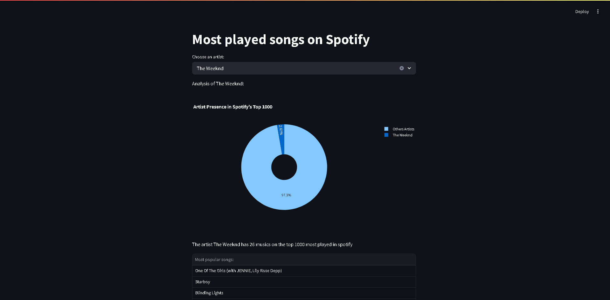

# 🎧 Spotify Top 1000 Songs Analysis

## 🖼️ Interface Preview

Below is a preview of the app interface, showcasing how users can interact with the dashboard and visualize artist insights:



## Overview

This project allows users to analyze the most played songs on Spotify. By selecting an artist, you can explore their presence in the top 1000 most played songs, discover their most popular albums, and see which songs are ranked the highest. The analysis is powered by **[Streamlit](https://streamlit.io/)** for the user interface, and **[Pandas](https://pandas.pydata.org/)** is used for data manipulation.

> 📊 **Dataset Source**: The data used in this project was obtained from [Kaggle - Top 1000 Most Played Spotify Songs of All Time](https://www.kaggle.com/datasets/kunalgp/top-1000-most-played-spotify-songs-of-all-time).

## Features ✨

- **Artist Selection**: Choose an artist from the dataset and get insights into their tracks.
- **Artist Share Analysis**: Visualize how much the selected artist contributes to the Spotify Top 1000 in comparison to others using a **pie chart**.
- **Most Played Songs**: Display the list of the most popular tracks for the selected artist.
- **Most Popular Album**: Find out which album by the artist is the most popular based on the Spotify popularity score.

## Technologies Used 🛠️

- **[Streamlit](https://streamlit.io/)**: For creating the interactive web app.
- **[Pandas](https://pandas.pydata.org/)**: For data manipulation and analysis.
- **[Plotly](https://plotly.com/python/pie-charts/)**: For data visualization (pie chart).
- **CSV File**: The project uses a CSV file downloaded from Kaggle.

## Setup and Installation ⚙️

1. Clone the repository to your local machine:
   ```bash
   git clone https://github.com/dmdlgg/spotify-analysis.git
2. Install the necessary dependencies
   ```bash
   pip install -r requirements.txt

3. Run the app
   ```
   streamlit run app.py

## 📫 Contact

Feel free to reach out to me on [LinkedIn](https://www.linkedin.com/in/eduardo-medolago-364288259/) or open an issue here on GitHub if you have any suggestions or questions!
